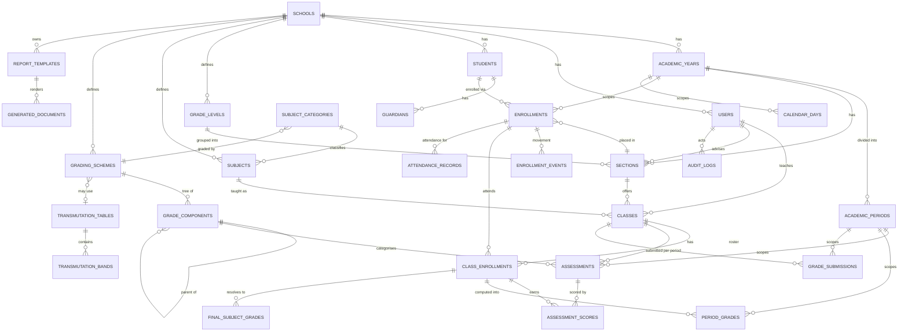

# 06 — Data Architecture

*Covers Parts 6, 8 and 18 of the audit brief.*

---

## Design rules

Every decision below follows from six rules. Where a rule conflicts with convenience, the rule wins.

1. **Every tenant-scoped table carries `school_id NOT NULL`**, and it participates in the table's unique constraints. Tenancy is not a filter the application remembers to apply.
2. **Identity is a UUID, never a name.** V0 keys grades and attendance by uppercased student name; that is the defect this rule exists to prevent.
3. **The three time layers are never collapsed:** permanent identity → year-specific enrollment → period-specific grades.
4. **Academic history is append-only.** Corrections version; they never overwrite. Nothing academic is ever hard-deleted.
5. **Structure is data, not schema.** Periods, grade levels, components, weights, transmutation bands, and attendance statuses are rows. Adding a fourth quarter is data entry.
6. **Computed values are stored with the configuration that produced them.** A grade computed under the 2026 scheme must still reproduce in 2029 after the scheme has changed.

---

## Conceptual ERD



---

## Entity reference

### Tenancy

**`schools`** — the tenant root.

| Field | Type | Notes |
|---|---|---|
| `id` | uuid PK | |
| `code` | text UNIQUE | Short slug, used for the subdomain |
| `name` | text NOT NULL | |
| `govt_school_id` | text | DepEd school ID (e.g. `301417`) |
| `region`, `division`, `district` | text | Appear on official forms |
| `address`, `contact_email`, `contact_phone` | text | |
| `logo_url`, `letterhead_url` | text | Storage references |
| `school_type` | text | public / private / etc. |
| `status` | text | `active` / `suspended` / `archived` |
| `timezone` | text | Default `Asia/Manila` |

**`school_settings`** — `(school_id, key, value jsonb)`. Feature flags and behavioural switches that do not deserve columns: portal visibility rules, attendance mode, approval-stage toggles.

> Typed columns for anything that appears on a document or is queried; a key/value bag for behavioural flags. Resist the temptation to put everything in JSON — a school's name is not a setting.

### Identity & access

**`users`** — `id`, `school_id` (nullable, for Mendtrix platform staff), `email` UNIQUE per school, `employee_id`, name parts, `status`, `last_login_at`, `deleted_at`.

**`staff_profiles`** — `user_id` PK, `position`, `employment_status`, `date_hired`, `qualifications`, `ancillary_assignments`. Exists to serve SF7; extends the login account rather than duplicating it.

**`roles`** — `id`, `school_id`, `code`, `name`, `is_system`. Seeded per tenant from the default template in [02 Roles & Workflow](02-roles-and-workflow.md), then editable.

**`permissions`** — global catalogue, `code` PK. Not tenant-scoped: the vocabulary is the same everywhere.

**`role_permissions`** — `(role_id, permission_code)`.

**`user_roles`** — `(user_id, role_id)`. Composable: a user holding both Teacher and Adviser is two rows, not a third role. This is the fix for V0's mutually-exclusive `role text check (role in ('subject','advisory',...))`.

### Academic structure

**`academic_years`** — `id`, `school_id`, `label` (`2026-2027`), `start_date`, `end_date`, `period_structure` (`quarter`/`semester`/`trimester`/`custom`), `status` (`planning`/`active`/`closed`/`archived`).

**`academic_periods`** — `id`, `school_id`, `academic_year_id`, `ordinal`, `name`, `short_name`, `start_date`, `end_date`, `expected_class_days`, `status`.
`UNIQUE (academic_year_id, ordinal)`

> **This table is the single most important structural fix over V0.** Three terms become three rows; four quarters become four rows; a school on semesters becomes two. No `CHECK (term IN (1,2,3))`, no `for (t=1; t<=3; t++)`.

**`grade_levels`** — `id`, `school_id`, `code`, `name`, `ordinal`, `key_stage`. Rows, not a `<select>`.

**`sections`** — `id`, `school_id`, `academic_year_id`, `grade_level_id`, `name`, `capacity`, `adviser_user_id`.
`UNIQUE (academic_year_id, grade_level_id, name)`
Sections are **per academic year** — "Grade 9 Pearl" in 2026-27 and in 2027-28 are different rows with different rosters. This is what keeps history intact.

**`subject_categories`** — `id`, `school_id`, `code`, `name`, `grading_scheme_id`. The join point between the curriculum and the grading engine.

**`subjects`** — `id`, `school_id`, `code`, `title`, `subject_category_id`, `units`, `is_active`. A real catalogue, replacing V0's free-text `subject` column.

**`grade_level_subjects`** — `(academic_year_id, grade_level_id, subject_id)`. The curriculum map that drives automatic class generation.

### Grading configuration

**`grading_schemes`** — `id`, `school_id`, `name`, `effective_from_year_id`, `pass_mark`, `rounding_mode`, `decimal_places`, `transmutation_table_id` (nullable), `period_aggregation` (`mean`/`weighted`), `status`.

A **null** `transmutation_table_id` means direct rounding — which is exactly how zero-based grading is expressed from SY 2027–2028 onward. No code change required for that transition.

**`grade_components`** — the tree.

| Field | Notes |
|---|---|
| `id` | PK |
| `grading_scheme_id` | FK |
| `parent_component_id` | nullable self-reference — this is what makes it a tree |
| `code`, `name` | `WW`, `PT`, `EX`, `ST1`, `ST2`, `TE` |
| `weight` | numeric, percentage of its parent level |
| `ordinal` | display order |

`CHECK`: sibling weights sum to 100 at every level, enforced by a deferred constraint trigger.

DO 015 s.2026 core subject, as rows:

```
WW  weight 20  parent NULL
PT  weight 50  parent NULL
EX  weight 30  parent NULL
ST1 weight 30  parent EX
ST2 weight 30  parent EX
TE  weight 40  parent EX
```

**`transmutation_tables`** — `id`, `school_id`, `name`, `effective_from_year_id`.
**`transmutation_bands`** — `table_id`, `min_initial`, `max_initial`, `output_grade`. V0's 41-row constant at `main.js:1` becomes seed rows here.

**`descriptor_bands`** — `id`, `school_id`, `grading_scheme_id`, `min_grade`, `max_grade`, `label`, `remark`. V0's Outstanding / Very Satisfactory / … bands, as configuration.

### Students — layer 1, permanent

**`students`**

| Field | Notes |
|---|---|
| `id` uuid PK | Stable forever. **Never a name.** |
| `school_id` | |
| `student_number` | School-assigned, unique per school |
| `lrn` | Learner Reference Number — indexed, validated, **nullable** (learners arrive without one) |
| `first_name`, `middle_name`, `last_name`, `suffix` | Separate fields; display name derived |
| `sex`, `birth_date`, `birth_place` | Required on official forms |
| `mother_tongue`, `religion`, `ethnicity` | |
| `address_*`, `barangay`, `municipality`, `province` | |
| `contact_number`, `email` | |
| `status` | `active` / `inactive` / `graduated` / `transferred_out` |
| `deleted_at` | Soft delete; master data only |

`UNIQUE (school_id, lrn) WHERE lrn IS NOT NULL AND deleted_at IS NULL`

**`guardians`** — `id`, `school_id`, `student_id`, `full_name`, `relationship`, `contact_number`, `email`, `address`, `occupation`, `is_primary`, `is_emergency_contact`, `portal_user_id` (nullable — reserved for the Phase 2 parent portal, so it can be added without migration).

### Enrollment — layer 2, per year

**`enrollments`** — the hinge of the whole model.

| Field | Notes |
|---|---|
| `id` uuid PK | |
| `school_id`, `student_id`, `academic_year_id` | |
| `grade_level_id`, `section_id` | |
| `date_enrolled` | |
| `status` | `enrolled` / `transferred_in` / `transferred_out` / `dropped` / `completed` |
| `promotion_status` | `promoted` / `retained` / `conditional` / null until year end |
| `general_average` | Computed and stored at finalization |
| `previous_school`, `remarks` | |

`UNIQUE (student_id, academic_year_id)`

**`enrollment_events`** — `id`, `enrollment_id`, `event_type` (`transfer_in`/`transfer_out`/`drop`/`re_entry`/`section_change`), `event_date`, `from_value`, `to_value`, `notes`. This is what makes SF4 possible; V0 has no equivalent at all.

### Classes

**`classes`** — `id`, `school_id`, `academic_year_id`, `section_id`, `subject_id`, `primary_teacher_id`, `grading_scheme_id` (override, else inherited from subject category), `status`.
`UNIQUE (academic_year_id, section_id, subject_id)`

Note what changed from V0: a class is defined by **subject × section × year**, and a teacher is an *attribute* of it. V0 defines a class as `(teacher_id, grade_level, section, school_year, subject)` — making the teacher part of the identity, so reassigning a teacher creates a different class and orphans its grades.

**`class_teachers`** — `(class_id, user_id, role)` for co-teaching. Phase 2; the `primary_teacher_id` column covers V1.

**`class_enrollments`** — the roster. `id`, `school_id`, `class_id`, `enrollment_id`, `date_added`, `date_dropped`, `status`.
`UNIQUE (class_id, enrollment_id)`

**Auto-populated** from `grade_level_subjects` × section enrollment. Teachers never type a roster.

### Assessments & scores

**`assessments`** — `id`, `school_id`, `class_id`, `academic_period_id`, `grade_component_id`, `ordinal`, `title`, `highest_possible_score`, `assessment_date`, `status`.
`UNIQUE (class_id, academic_period_id, grade_component_id, ordinal)`

Rows, not columns. This single change removes V0's 10-item cap, makes DO 015's ST1/ST2 ordinary records, and lets a teacher give a title to each assessment instead of "WW3".

**`assessment_scores`** — `id`, `school_id`, `assessment_id`, `class_enrollment_id`, `raw_score`, `is_excused`, `encoded_by`, `encoded_at`, `updated_at`.
`UNIQUE (assessment_id, class_enrollment_id)`
`CHECK (raw_score >= 0)`

`is_excused` distinguishes "did not take it, legitimately" from "no score recorded yet" — a distinction V0 cannot make, and the root of its habit of treating missing components as zero.

### Computed grades

**`period_grades`** — one row per learner per class per period.

| Field | Notes |
|---|---|
| `id`, `school_id`, `class_enrollment_id`, `academic_period_id` | |
| `component_breakdown` jsonb | Per-component total, PS, WS — the audit trail of the computation |
| `initial_grade` numeric | Pre-transmutation |
| `period_grade` numeric | Post-transmutation, or rounded directly |
| `status_code` | null, or `INC` / `DRP` / `EXM` |
| `scheme_snapshot` jsonb | **The scheme as it stood at computation time** |
| `version` int | Increments on correction; prior versions retained |
| `computed_at`, `computed_by` | |

`UNIQUE (class_enrollment_id, academic_period_id, version)`

> **`scheme_snapshot` is what makes historical fidelity real.** Without it, changing a weight in 2028 silently rewrites what a 2026 grade "would have been." With it, the 2026 grade remains reproducible and explainable forever.

**`final_subject_grades`** — `id`, `school_id`, `class_enrollment_id`, `final_grade`, `remark`, `status_code`, `version`, `computed_at`.

### Workflow

**`grade_submissions`** — `id`, `school_id`, `class_id`, `academic_period_id`, `status`, `submitted_by`, `submitted_at`, `returned_by`, `returned_at`, `return_reason`, `approved_by`, `approved_at`, `finalized_at`, `published_by`, `published_at`, `reopened_by`, `reopened_at`, `reopen_reason`, `version`.

`UNIQUE (class_id, academic_period_id)`

The **class × period** grain is the fix for V0's `classes.is_submitted` boolean, which cannot express per-period state.

**`grade_change_requests`** — `id`, `school_id`, `period_grade_id`, `requested_by`, `reason`, `proposed_value`, `status`, `resolved_by`, `resolved_at`, `resolution_note`.

### Attendance

**`calendar_days`** — `id`, `school_id`, `academic_year_id`, `date`, `day_type` (`class_day`/`holiday`/`suspension`/`non_teaching`), `description`.
`UNIQUE (academic_year_id, date)`

This table is the correct denominator. V0's SF4 divides by days *recorded*; the right divisor is `COUNT(*) WHERE day_type = 'class_day'` over the range.

**`attendance_statuses`** — `id`, `school_id`, `code`, `label`, `symbol`, `counts_as` (`present`/`absent`/`neutral`), `ordinal`.

**`attendance_records`** — `id`, `school_id`, `enrollment_id`, `class_id` (**nullable**), `calendar_day_id`, `attendance_status_id`, `recorded_by`, `recorded_at`, `note`.

`class_id IS NULL` means daily/homeroom attendance owned by the adviser; a value means per-subject attendance. One table serves both modes, selected by `school_settings`.

`UNIQUE (enrollment_id, COALESCE(class_id, '00000000-…'::uuid), calendar_day_id)` as a unique index.

### Documents

**`report_templates`** — `id`, `school_id`, `code`, `version`, `data_source`, `config` jsonb, `effective_from`, `status`.
`UNIQUE (school_id, code, version)`

**`generated_documents`** — `id`, `school_id`, `template_id`, `template_version`, `document_number`, `subject_type` (`student`/`section`/`class`/`school`), `subject_id`, `academic_year_id`, `generated_by`, `generated_at`, `file_path`, `checksum`, `status` (`draft`/`issued`/`superseded`/`voided`), `superseded_by`.

**`document_number_sequences`** — `(school_id, document_type, academic_year_id, next_value)`. Numbering is per school per year, allocated atomically.

### Operations

**`audit_logs`** — `id`, `school_id`, `actor_user_id`, `action`, `entity_type`, `entity_id`, `old_values` jsonb, `new_values` jsonb, `reason`, `ip_address`, `user_agent`, `created_at`. **Append-only**, enforced by revoking UPDATE and DELETE from every role including the service role.

**`notifications`** — `id`, `school_id`, `recipient_user_id`, `type`, `title`, `body`, `link`, `read_at`, `created_at`. Never contains a grade value (FR-NOT-7).

**`import_batches`** — `id`, `school_id`, `import_type`, `filename`, `uploaded_by`, `status`, `row_count`, `success_count`, `error_count`, `report` jsonb, `created_at`.

**`announcements`** — `id`, `school_id`, `title`, `body`, `audience` jsonb, `published_at`, `expires_at`, `created_by`.

---

## Constraints & indexes

### Tenant integrity

Every tenant-scoped table:

```sql
school_id uuid NOT NULL REFERENCES schools(id)
```

Composite foreign keys carry `school_id` so a cross-tenant reference is impossible at the database level, not merely unlikely:

```sql
-- classes cannot reference a section belonging to another school
FOREIGN KEY (school_id, section_id) REFERENCES sections(school_id, id)
```

This is worth the extra column on the referenced side. It converts an entire category of catastrophic bug into a constraint violation.

### Index strategy

```sql
-- tenant-first on every hot path
CREATE INDEX ON enrollments (school_id, academic_year_id, section_id);
CREATE INDEX ON class_enrollments (school_id, class_id);
CREATE INDEX ON assessment_scores (school_id, assessment_id);
CREATE INDEX ON period_grades (school_id, class_enrollment_id, academic_period_id);
CREATE INDEX ON attendance_records (school_id, enrollment_id, calendar_day_id);
CREATE INDEX ON audit_logs (school_id, entity_type, entity_id, created_at DESC);
CREATE INDEX ON grade_submissions (school_id, academic_period_id, status);

-- learner lookup
CREATE INDEX ON students (school_id, lrn) WHERE lrn IS NOT NULL;
CREATE INDEX ON students USING gin (school_id, to_tsvector('simple',
    coalesce(first_name,'') || ' ' || coalesce(last_name,'')));

-- the registrar's most frequent question: what is missing?
CREATE INDEX ON grade_submissions (school_id, academic_period_id)
    WHERE status IN ('draft', 'returned');
```

Every index leads with `school_id`. Under RLS, every query is tenant-filtered, so a tenant-first index is the one the planner can actually use.

### Uniqueness that prevents real bugs

| Constraint | Prevents |
|---|---|
| `enrollments (student_id, academic_year_id)` | A learner enrolled twice in one year |
| `class_enrollments (class_id, enrollment_id)` | A duplicate roster entry |
| `assessment_scores (assessment_id, class_enrollment_id)` | Two scores for one assessment |
| `grade_submissions (class_id, academic_period_id)` | Parallel submission states |
| `academic_periods (academic_year_id, ordinal)` | Two "Term 2"s |
| `students (school_id, lrn) WHERE lrn IS NOT NULL` | Duplicate learners by LRN |
| `sections (academic_year_id, grade_level_id, name)` | Two "Grade 9 Pearl" in one year |

---

## PART 22 — Historical Data Strategy

### The requirement

A learner's Grade 8 record must remain accessible, accurate, and reproducible after they reach Grade 9 — and after the grading scheme changes, after the section is renamed, after the teacher leaves, and after the school year is archived.

### How the model achieves it

**1. Academic year is a first-class dimension.**
`enrollments`, `sections`, `classes`, `academic_periods`, and `calendar_days` all hang off `academic_year_id`. Nothing academic is global. Querying 2026–2027 cannot accidentally return 2027–2028 data because they are different rows.

**2. Sections and classes are per year.**
"Grade 9 Pearl" in 2026-27 is a different `sections` row from 2027-28. Renaming or dissolving this year's section leaves last year's untouched.

**3. Computed grades carry their scheme.**
`period_grades.scheme_snapshot` freezes the weights, transmutation table, rounding, and pass mark used. When zero-based grading arrives in SY 2027–2028, every prior grade remains reproducible under the rules that actually produced it.

**4. Corrections version, never overwrite.**
`period_grades.version` increments. The prior row survives. The audit log links them with actor and reason. "What was this grade before it was corrected, and who changed it?" is a query.

**5. Teachers are referenced, never inlined.**
`classes.primary_teacher_id` points at a `users` row that is deactivated, not deleted, when staff leave. Historical authorship survives staff turnover.

**6. Archived years become read-only.**
`academic_years.status = 'archived'` is enforced by a trigger that rejects writes to any dependent academic row. Read access is unaffected. This is a data-integrity control, not a permission — it holds even for an administrator.

**7. Deletion is not a thing academic records do.**

| Data | Policy |
|---|---|
| Master data (students, users, subjects, sections) | Soft delete via `deleted_at`; excluded from active queries |
| Academic records (grades, scores, attendance, enrollments) | **Never deleted.** Voided with a reason, retaining the row |
| Audit logs | Never deleted or modified by anyone |
| Generated documents | Marked `superseded` or `voided`; the file is retained |

**8. Documents are archived, not regenerated.**
A report card issued in 2026 is stored as a file with its template version and signatory set recorded. Reprinting it in 2029 returns the *original artifact*, not a fresh render under today's configuration. Where a genuine re-render is needed, it is a new document that supersedes the old, and both are retained.

### Year rollover

The operation that ends and begins a school year, run once per year by the administrator:

```
1. Verify all submissions for the final period are finalized
2. Compute and store final subject grades and general averages
3. Determine promotion status per enrollment (per configured rules)
4. Generate end-of-year documents (promotion report, report cards)
5. Set academic_year.status = 'closed'
6. Clone configuration into the next year:
      grade levels, subjects, curriculum map, grading schemes,
      sections (as templates), calendar skeleton
7. Carry forward promoted learners into new enrollments
8. Leave retained learners at their grade level, new enrollment row
9. After a defined settling period, set status = 'archived' (read-only)
```

Step 7 is worth emphasising: it creates **new** `enrollments` rows. It does not modify the prior year's rows in any way. A learner moving from Grade 8 to Grade 9 gains a record; they do not have one rewritten.

---

## What is deliberately *not* in this model

| Excluded | Why |
|---|---|
| Form-shaped tables (`sf9_data`, etc.) | Forms are outputs. See [05 School Forms Strategy](05-school-forms-strategy.md). |
| Textbook inventory | SF3's domain. Out of scope. |
| Health measurements | SF8's domain. Phase 3 at earliest, with its own privacy analysis. |
| Timetable / scheduling | Phase 3. |
| Fees and payments | Phase 3, and arguably a separate product. |
| A district or division tier above `schools` | Not needed for V1. The model does not preclude adding it — `schools` gains a nullable parent — but building it now is speculative. |

---

# PART 6 — Database Gap Analysis

*Current `supabase_schema.sql` vs. the target model above.*

## Table-by-table verdict

| V0 table | Verdict | Gap |
|---|---|---|
| `teacher_profiles` | 🔧 **Split** | Conflates login, staff profile, role, and school identity in one table. School fields are text defaults (`'Angono National High School'`, lines 22–25). Role is a mutually-exclusive `CHECK` — an adviser who also teaches subjects cannot be represented. → `users` + `staff_profiles` + `user_roles` + `schools` |
| `classes` | 🔧 **Redefine** | A class is keyed by `(teacher_id, grade_level, section, school_year, subject)` — the **teacher is part of the identity**, so reassigning a teacher creates a different class and orphans its grades. `grade_level`, `section`, `subject` are free text with no catalogue. School fields duplicated again. → `classes(academic_year_id, section_id, subject_id, primary_teacher_id)` |
| `students` | ❌ **Rebuild** | `class_id NOT NULL` — a learner in 6 subjects is 6 unrelated rows. No master record, no LRN uniqueness, no enrollment concept. Binary `gender CHECK`. → `students` + `enrollments` + `class_enrollments` |
| `hps_settings` | ❌ **Rebuild** | 20 flat columns `ww1..ww10`, `pt1..pt10`, plus `te`. Hard 10-item cap. `term IN (1,2,3)`. Cannot express DO 015's ST1/ST2. → `assessments` rows |
| `grades` | ❌ **Rebuild** | Same 20 flat score columns plus stored computed columns with weights baked into comments (`PS * 0.30`). `term IN (1,2,3)`. No scheme snapshot, no versioning. → `assessment_scores` + `period_grades` |
| `attendance` | 🔧 **Extend** | Reasonable shape, but `status CHECK ('P','A','L')` is hard-coded (no Excused), there is no school calendar, and no expected-days denominator. → `attendance_records` + `calendar_days` + `attendance_statuses` |
| `diagnostic_tests` | 🔧 **Generalize** | A special one-row-per-class table for a single pre-test. → an ordinary assessment |
| `registrar_submissions` | 🔧 **Redefine** | Keyed by `class_id` only — **cannot express per-period state** ("Term 2 submitted, Term 3 in progress"). Stores a `grade_snapshot jsonb` because there is no reliable versioning. → `grade_submissions(class_id, academic_period_id)` |
| `v_final_grades` | 🔧 **Replace** | Hard-codes exactly three terms in the pivot. → period-agnostic aggregation |
| `v_attendance_monthly` | 🔧 **Replace** | Counts only recorded days; no expected-days denominator. |

## Missing entirely — 24 tables

**Tenancy:** `schools`, `school_settings`
**Access:** `roles`, `permissions`, `role_permissions`, `user_roles`, `staff_profiles`
**Structure:** `academic_years`, `academic_periods`, `grade_levels`, `sections`, `subjects`, `subject_categories`, `grade_level_subjects`
**Grading config:** `grading_schemes`, `grade_components`, `transmutation_tables`, `transmutation_bands`, `descriptor_bands`
**Enrollment:** `enrollments`, `enrollment_events`, `class_enrollments`, `guardians`
**Calendar:** `calendar_days`, `attendance_statuses`
**Computed:** `period_grades`, `final_subject_grades`, `grade_change_requests`
**Documents:** `report_templates`, `generated_documents`, `document_number_sequences`
**Ops:** `audit_logs`, `notifications`, `import_batches`, `announcements`

## Defects in the existing SQL

Two would fail or misbehave if the schema were ever applied — worth noting because they show the file has never been run:

1. **`registrar_submissions` INSERT policy is invalid** (line 288): `for insert ... using (...)`. Postgres requires `with check` for INSERT and rejects this policy.
2. **`supabase.js:129` upserts students `onConflict:'class_id,full_name'`** — no such unique constraint exists in the schema, so the upsert would fail.

Additionally: no indexes are declared anywhere beyond primary keys and unique constraints; no soft-delete columns; no audit mechanism; and `school_id` is a text *attribute*, never a foreign key — so nothing prevents cross-school references.

## What carries forward

| Asset | Where it goes |
|---|---|
| Transmutation table (`main.js:1`) | Seed rows in `transmutation_bands` |
| LOA / descriptor bands (`main.js:633`) | Seed rows in `descriptor_bands` |
| RLS *intent* — teacher owns rows, registrar sees all | The right instinct; reimplemented tenant-first |
| `updated_at` trigger pattern (lines 380–402) | Reusable as-is |
| Three-term structure | Becomes three `academic_periods` **rows** |
| P/A/L statuses | Become three `attendance_statuses` rows, plus Excused |

## Migration path

There is no incremental migration from V0's schema, and attempting one would be more work than a clean build. The reasons are structural rather than cosmetic: students are class-owned, grades are name-keyed in the live data (localStorage) and column-keyed in the SQL, and no school entity exists to attach anything to.

**Recommended path:** build the target schema fresh, then import V0 data — where any exists — through the standard importer in [10 Excel Migration](10-excel-migration.md), treating V0 exports as just another source file. In practice the pilot school's real data will come from their Excel files, not from V0, since V0 has never held production data.
